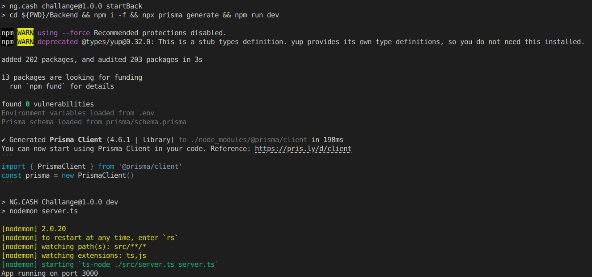
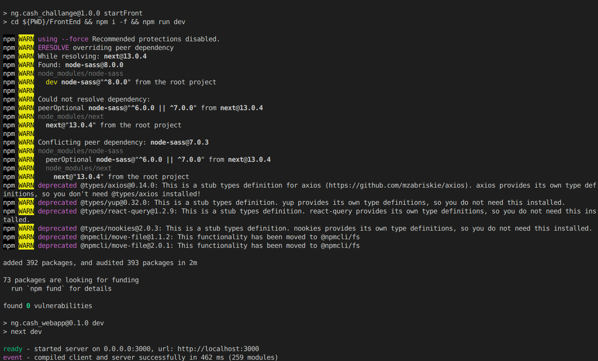
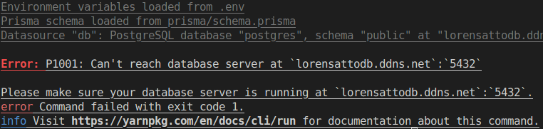
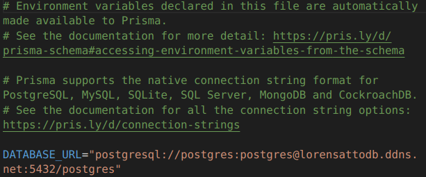
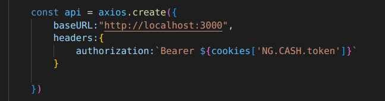

# NG.CASH projeto

escopo do projeto:

https://ngcash.notion.site/Processo-Seletivo-NG-TRYBE-223de32e1ed047f2aa90cc0da84754ee

___

<h2 style="color:red;">Necessário ter o Nodejs instalado na maquina.</h2>

<h6>Caso não tenha o Node.js instalado, segue as formas para cada plataforma: </h6>

<h3>Windows</h3>

O link abaixo recupera um arquivo .msi que instalará o nodejs no padrão <i>next,next,finish</i>. Após finalizar a instalação, será possível prosseguir com a execução do projeto.

https://nodejs.org/dist/v18.12.1/node-v18.12.1-x86.msi

<h3>Linux</h3>

<h5>Snap</h5>

Caso tenha o <code>snapd</code> instalado na maquina execute no terminal o comando abaixo para instalar a ultima versão do nodeJs 

<code>sudo snap install node --classic</code>

<h5>Flatpak</h5>

Caso tenha o <code>flatpak</code> instalado na maquina execute no terminal o comando abaixo para instalar a ultima versão do nodeJs 

<code>flatpak install org.freedesktop.Sdk.Extension.node18</code>

<h5>Debian (Ubuntu)</h5>

Para instalar a versão LTS no Linux Ubuntu, devemos digitar no terminal os seguintes comandos: 

<code>curl -fsSL https://deb.nodesource.com/setup_lts.x | sudo -E bash -</code>

depois :

<code>sudo apt-get install -y nodejs</code>

<h4>MacOS</h4>

O link abaixo recupera um arquivo .pkg que instalará o nodejs. Após finalizar a instalação, será possível prosseguir com a execução do projeto.

https://nodejs.org/dist/v18.12.1/node-v18.12.1.pkg
___

### Como executar o projeto ?

Para rodar o projeto como pretendo será necessário executar 2 comando no terminal do sistema para que seja possível testar o projeto.

<h3>Primeiro Passo</h3>

No diretório raiz do projeto, abra o terminal do sistema e tenha certeza de que o diretório do terminal esteja direcionado para a raiz do projeto contendo as pastas 'Backend', e 'FrontEnd'

no caso do terminal do linux da seguinte forma:

<code>usuario@desktop:~/Qualquer_diretório/NG.Cash_Challange$ </code>

<h3>Segundo Passo</h3>

Vamos rodar o Back e o Front!

Nota: Os comandos abaixo funcionam independente da plataforma, sendo os comando possíveis de serem executados por recursos fornecidos pelo próprio NodeJs.

1 - Ainda na raiz do projeto, execute o comando :
<code>npm run startBack</code>

Para saber se o comando funcionou, ficará assim :

<h4 style='color:red;'>Após a execução do comando, não feche o terminal pois isso encerrará a execução do backEnd</h4>

2 - Com outro terminal aberto no diretório raiz do projeto, execute o seguinte comando:

<code>npm run startFront</code>

<h4 style='color:red;'>Após a execução do comando, não feche o terminal pois isso encerrará a execução do frontEnd</h4>

Para saber se deu tudo certo, ficará assim:

Se a execução for bem sucedida, Repare que na penultima linha onde esta escrito ready em verde,  ao final dela, estará o link onde está sendo executado o projeto para teste ;)

___
### Troubleshoot (Possíveis problemas) 

Ao executar um dos comandos acima pode ocorrer algumas falhas possíveis.

<h3>ERRO: 'Error: P1001: Can't reach database server at `lorensattodb.ddns.net`:`5432`'</h3>

no comando: <code>npm run startBack</code>

Para que não houvesse necessidade de configurar um banco postgresql somente para testar a aplicação, direcionei o backEnd para que contata-se ao meu banco particular de testes, mas pode correr o risco do sistema não estar disponível por varias razões, com isso, segue abaixo a solução para o erro.

<h4>terminal:</h4>

<h4>Solução:</h4>

Será necessário inserir um endereço jdbc de um banco de dados postgresql no arquivo .env

O arquivo esta no diretório /Backend/.env, e nele você irá substituir o conteúdo da variável DATABASE_URL pelo endereço jdbc do seu bando de dados incluindo usuário e senha.

<h3>ERRO: 'Error: listen EADDRINUSE:address already in use :::3000'</h3>

no comando: <code>npm run startBack</code>

Por algum motivo a porta 3000 do seu computador ja esta sendo ultilizada.

<h4>Solução:</h4>

Com isso será necessário alterar o valor da porta manualmente no arquivo .env no diretório /Backend/.env. Nele você irá substituir o conteúdo da variável PORT pelo novo número de porta ( Pode ser qualquer número ) e volte ao terminal na raiz do projeto e execute novamente o comando <code>npm run startBack</code>, se o problema persistir tente outros números até funcionar.

Caso tenha conseguido resolver o problema, será necessário alterar o arquivo /FrontEnd/src/utils/Axios.tsx.

Procure pelo bloco de código acima e onde esta o valor 3000 ao lado de 'http://localhost:' inclua a nova porta de permitiu o funcionamento o backEnd.
